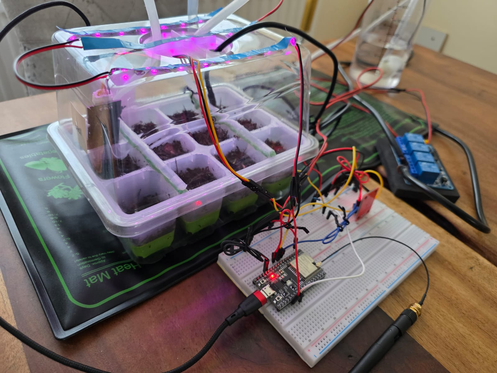

# Smart Sow
🔗 **Live Site:** [Smart Sow](https://smartsow-d54bd7aaa207.herokuapp.com/index.html)

---
Smart Sow is an indoor seed germination assistant that uses IoT and web technologies to automate plant care. Each seedling tray is equipped with temperature, humidity, and UV light sensors. The system compares real-time readings to user-defined thresholds and automatically activates UV LEDs, watering pumps, or heating mats as needed.

> This project is ideal for tech-savvy gardening enthusiasts who want to combine sustainability, electronics, and automation.

## Electronics Overview
Please see the [electronics](./electronics.md) for detailed specs and wiring diagrams.

 
*Figure 1 - Built seedling tray - electronics, sensors, arduino, water-pump, heating mat, uv leds* 

## Screenshots
Please see the [screenshots](./screenshots.md) of the front end here.


*Figure 2 – Home Page* 

## Demo video
[](https://youtu.be/xRuPIhFsNYA)

## Table of Contents

- [🔗Live Site](#smart-sow)
- [Electronics Overview](#electronics-overview)
- [Screenshots](#screenshots)
- [Demo Video](#demo-video)
- [Tech Stack](#tech-stack)
- [Key Features](#key-features)
  - [Login Required](#login-required)
  - [Modal Charts](#modal-charts)
  - [Chart Scales and Data Normalization](#chart-scales-and-data-normalization)
  - [Gauge Charts](#gauge-charts)
  - [Stacked Bar Charts](#stacked-bar-charts)
- [My Trays](#my-trays)
- [User Flow](#user-flow)
- [Materials Required](#materials-required)
- [Setup & Installation Guide](#setup--installation-guide)
  - [1. Prerequisites](#1-prerequisites)
  - [2. Clone the Repository](#2-clone-the-repository)
  - [3. Backend Setup NET API](#3-backend-setup-net-api)
  - [4. Frontend Setup](#4-frontend-setup)
  - [ESP32 Configuration](#esp32-configuration)
- [Future Improvements](#future-improvements)
- [Important Notes](#important-notes)
- [Design Choices](#design-choices)
- [Responsive Design](#responsive-design)
- [License](#license)
- [Author](#author)

## Tech Stack

- **Backend**: C#, .NET, ASP.NET, Entity Framework
- **Frontend**: JavaScript, HTML, CSS, Bootstrap
- **Database**: PostgreSQL
- **Microcontroller**: ESP32 (C/C++ using Arduino IDE)
- **Deployment**: Heroku
- **Charts**: ECharts.js


## Key Features

- Secure user authentication with hashed and salted passwords
- Tray registration and configuration:
  - Humidity level (Low, Medium, High)
  - Temperature threshold (°C)
  - UV light hours
- Real-time sensor monitoring
- Automated control of:
  - UV LEDs
  - Water pump
  - Heating mat
- Sensor history tracking with charts
- Interactive gauge and bar charts
- Deactivation of trays when crops are transplanted
- Secure tray-token pairing between backend and ESP32


## Login Required

All features—tray registration, sensor monitoring, automation, and charts—require the user to be logged in. Without authentication, access to system features is restricted.


## Modal Charts

The modal charts provide the most insightful and up-to-date data in the entire application. They reflect the real-time environment inside each seedling tray by displaying detailed historical sensor readings.

When a user clicks on any gauge chart (e.g., temperature, humidity, or UV light), a stacked bar chart appears in a modal window. This chart shows:

- All recorded readings from the selected sensor
- Timestamps when automatic actions (e.g., heating mat, UV LEDs, or water pump) were triggered

For example, clicking the temperature gauge will open a modal showing a timeline of temperature readings for that tray, alongside the exact moments the heating mat was turned **on** (`10`) or **off** (`0`). Internally, these values are represented as `true` or `false` (1 or 0), but are scaled to `10` for better visibility within the stacked chart.

### Chart Scales and Data Normalization:

- **Temperature Chart**:
  - Max value: **40°C**
  - This default scale is suitable for cooler climates like the UK. In hotter regions, this value may need to be increased for accurate visualization.
  
- **Humidity and UV Light Charts**:
  - Max value: **100%**
  - Raw sensor readings are processed and translated into percentage values to make them more meaningful and intuitive for users.

- **Humidity**: Displayed:
  - Low: < 50%
  - Medium: < 75%
  - High: 100%

- **UV Light**: A daily exposure counter that resets at 7 AM by default to track artificial UV lighting. Users can customize the reset time in the Arduino code to better suit their needs.

### Gauge charts 
Display the most recent sensor readings — including temperature, humidity, and UV light — in a clear and intuitive format, giving users an instant snapshot of their tray's current conditions.

### Stacked bar charts 
Display the activation history of all automated components — including watering, heating, and UV LEDs — alongside sensor readings for a comprehensive overview of the tray’s environment.


## My Trays

- View real-time status and history
- Edit tray settings
- Deactivate trays when no longer needed


## User Flow

**Register Account**  
Name, email, postcode, password (hashed + salted)  

**Edit Account**
Name, email, postcode. (Password future implementation) 

**Register Tray**  
Tray name, crop type, sowing date, thresholds  

**Edit Tray**  
Tray name, crop type, sowing date, thresholds  

**Configure ESP32**  
Copy tray token and upload Arduino code  

**Monitor Trays**  
Real-time readings and automation

**View Charts**  
Historical data and sensor trends

**Deactivate Tray**
Pause monitoring and automation for trays no longer in use

**Logout**
Displayed in the user menu, when logged in.
[See login requirements and details here → login-required](#login-required)


## Materials Required

- Seedling tray, seeds, and soil
- ESP32 microcontroller
- Temperature sensor
- Humidity sensor
- UV light sensor
- Water pump + tubing + water container
- UV LEDs
- Heating mat (use with a relay and handle 230V safely)
- Relay module
- Breadboard or soldered circuit
- USB power supply or power bank
- Jumper wires

See [electronics.md](./electronics.md) for detailed specs and wiring diagrams.

---

## Setup & Installation Guide

### 1. Prerequisites

Install the following:

- [.NET 8+ SDK](https://dotnet.microsoft.com/download)
- [PostgreSQL](https://www.postgresql.org/download/)
- [Git](https://git-scm.com/)

---

### 2. Clone the Repository

```bash
git clone https://github.com/JuMaxi/smart-sow.git
cd smart-sow
```

---

### 3. Backend Setup (.NET API)

1. Open `appsettings.json`
2. Set your PostgreSQL connection string

Then:

```bash
dotnet restore
dotnet ef database update
dotnet run
```

---

### 4. Frontend Setup

- The frontend is static (HTML, CSS, JS, Bootstrap)
- Served directly by the ASP.NET backend — no build step needed


## ESP32 Configuration

[See detailed electronics setup & wiring instructions here → electronics.md](./electronics.md)


## Future Improvements

- Unit tests and input validation for backend
- Features for users:
  - Change password
  - Delete account
- Sunlight estimation via postcode APIs


## Important Notes

- This is a **prototype**, not a commercial product
- Handle 230V appliances (heating mats) with **extreme caution**
- Designed for users with basic programming and electronics experience


## Design Choices

The design of **Smart Sow** focuses on delivering a modern and elegant user experience that complements its innovative IoT functionality.

- **Glassmorphism Effects**: I use glassmorphism in the UI to create a sleek, translucent overlay that adds depth and sophistication, providing a contemporary and clean aesthetic to the front-end.

- **AI-Generated Realistic Plant Images**: To reinforce the project's tech-driven nature, plant images used throughout the app are generated by AI with realistic detail. This choice merges the natural theme with cutting-edge technology, highlighting the intelligent aspect of Smart Sow.

- **Background Image**: Unlike the AI-generated plant images, the background features a real photograph to maintain authenticity and a natural atmosphere, grounding the overall design in reality.

- **Color Palette**: The interface predominantly uses green and white tones, reflecting growth, freshness, and simplicity — key themes aligned with gardening and sustainability.

These elements together create a visually appealing and thematically consistent environment for users to engage with their smart seed-growing experience.


## Responsive Design

Smart Sow is designed to provide an optimal user experience across a wide range of devices and screen sizes. The layout and UI components adapt seamlessly from desktop monitors to tablets and smartphones by using:

- **Flexible grids and layouts** that adjust content spacing and alignment dynamically.
- **Scalable typography and buttons** to ensure readability and usability on smaller screens.
- **Media queries** to tailor styles and element visibility based on device width.
- **Touch-friendly interactions** on mobile devices for smooth and intuitive navigation.

This responsive approach ensures that users can monitor and control their smart seed trays comfortably, whether at home or on the go.


## License

- The background image used in this project is sourced from [Pixabay](https://pixabay.com/), which provides royalty-free images for commercial use without attribution required.
- The project utilizes **ECharts** — an open-source charting library — to display sensor data visualizations. ECharts is licensed under the [Apache License 2.0](https://www.apache.org/licenses/LICENSE-2.0).

Please refer to their respective licenses for more details.


## Author

Developed with love by a passionate gardener and developer who believes in combining sustainability with smart tech.