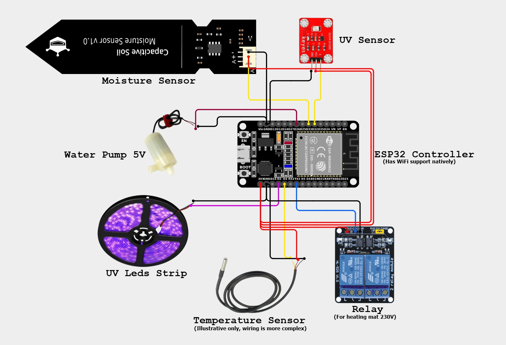
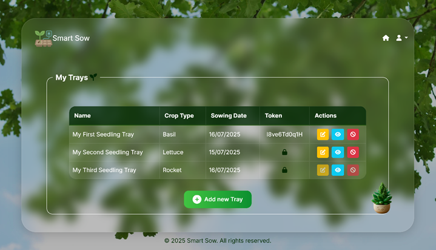

*Figure 1: Wiring diagram for the Smart Tray electronics setup.*

### Microcontroller (ESP32) Setup
1) Download [Arduino IDE](https://www.arduino.cc/en/software)
2) Install the board plugin (see below)
3) Install the libraries OneWire, DallasTemperature and ArduinoJson.h
4) Download and install drivers: https://www.silabs.com/developer-tools/usb-to-uart-bridge-vcp-drivers?tab=downloads
5) Reboot


**Step 1**: Install the ESP32 Board Package
Open Arduino IDE.
Go to File → Preferences.
In the "Additional Board Manager URLs" field, add this URL:
https://raw.githubusercontent.com/espressif/arduino-esp32/gh-pages/package_esp32_index.json
Click OK.

**Step 2**: Install ESP32 Board Support
Go to Tools → Board → Boards Manager.
Search for "ESP32".
Click Install on the package by Espressif Systems.

**Step 3**: Select the Board
Go to Tools → Board → ESP32 Arduino.
Select "ESP32 Dev Module" — this works for most ESP32-WROOM-32U boards, unless your board has a custom definition.
Set the following typical options (under Tools menu):
Flash Frequency: 80 MHz
Flash Mode: QIO
Partition Scheme: Default (or Minimal SPIFFS if needed)
Upload Speed: 115200 or 921600
Core Debug Level: None
Port: Select the correct COM port (usually appears when plugged in)

**Step 4**: Connect Your Board
Connect the ESP32 board using a USB to Serial adapter if your development board doesn’t include USB.
Make sure GPIO0 is pulled LOW during flashing (some boards have a boot button for this).
Press "Upload" in the Arduino IDE and follow the prompt to reset the board (if needed).

Special Note for the WROOM-32U:
If you're using the U.FL connector for an external antenna, make sure:
The PCB trace/jumper is configured to route to the external antenna.
Some dev boards may have a solder bridge you must change from PCB antenna to U.FL.

With arduino IDE opened, and the settings above ready, follow the steps below:
1. Set your:
   * `API_HOST` (your local host or deployed link)
   * `TRAY_ID`
   * `TOKEN` 
   *After registering your tray, navigate to the **My Trays** page. Locate your tray and click the lock icon to reveal the tray **token**. Copy and paste this token into the appropriate field in your `secrets.h` file.. *
   
2. Create a `secrets.h` file.

3. In `secrets.h`, define your Wi-Fi credentials and tray token as follows:
    ```cpp
    #define WIFI_NAME "Your WiFi Name"
    #define WIFI_PASSWORD "Your WiFi Password"
    #define TOKEN "Your Tray Token"


*Figure 2: My trays web page.*

4. Add secrets.h to your .gitignore file to ensure sensitive data is not pushed to version control.

5. In your Arduino code, include the secrets file by adding:

    ```cpp
    #include "secrets.h"

6. Customize delays to suit your specific tray setup.

7. Connect your ESP32 to your computer

8. In the Arduino IDE, select the correct board and COM port (if not automatically selected).

9. Compile and upload the code to the ESP32.

10. Use the Serial Monitor to debug or follow sensor readings and check Wi-Fi connection status in real time.

### Part List
- ESP32 32 Controller: https://www.aliexpress.com/item/1005006613312645.html
- Controller Antenna: https://www.aliexpress.com/item/1005008209944531.html
- Moisture Sensor: https://www.aliexpress.com/item/1005008744986367.html
- UV Sensor: https://www.aliexpress.com/item/1005008915304010.html
- Temperature Sensor: https://www.aliexpress.com/item/1005008942773994.html
- Plant Growing UV LEDs: https://www.aliexpress.com/item/1005007486917090.html
- Relay: https://www.aliexpress.com/item/1005006127747874.html
- Water Pump: https://www.aliexpress.com/item/1005002072493503.html
- Tubing 5x7: https://www.aliexpress.com/item/1005006311142286.html
- Seedling Heat Mat: https://www.amazon.co.uk/dp/B08S6PLLLB
- Seedling Seed Tray: https://www.amazon.co.uk/dp/B0CDG3CZ7R

**Optional**
- Wires: https://www.aliexpress.com/item/1005008154587906.html
- Breadboard: https://www.aliexpress.com/item/1005007174397080.html

### Connecting Sensors and Components

When assembling your seedling tray with electronic components, make sure each sensor and actuator is connected to the correct **ESP32** GPIO pin, as defined in the Arduino code.

Below is a table listing all pin assignments:

| Component           | Type   | Description             | ESP32 Pin |
|---------------------|--------|--------------------------|-----------|
| **UV Sensor**       | Input  | Measures UV light        | GPIO 32   |
| **Humidity Sensor** | Input  | Measures soil moisture   | GPIO 33   |
| **Temperature Sensor** | Input  | Measures temperature      | GPIO 4    |
| **UV LEDs**         | Output | Controls UV lighting     | GPIO 2    |
| **Water Pump**      | Output | Activates irrigation     | GPIO 26   |
| **Heating Mat**     | Output | Powers heating element   | GPIO 17   |

> `analogRead()` is used for input sensors, and `digitalWrite()` is used for controlling output components like the pump, heating mat, and UV LEDs.

Ensure your wiring matches these pin assignments before powering up your ESP32 to avoid hardware issues.


