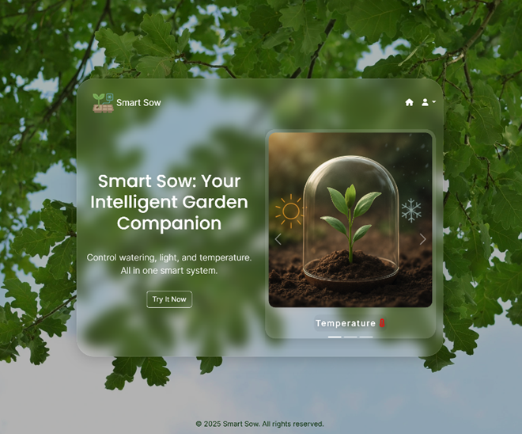
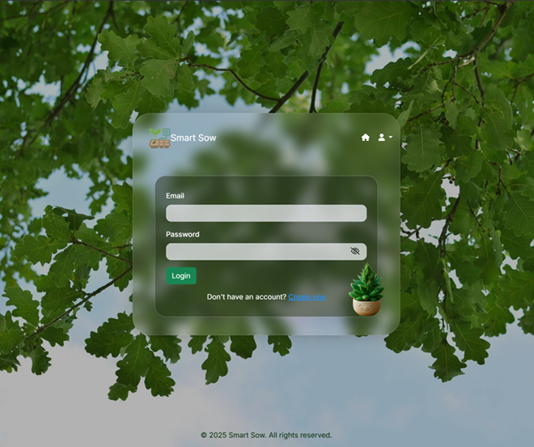
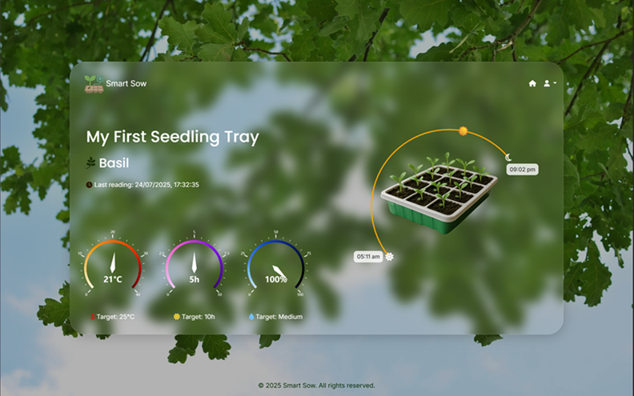
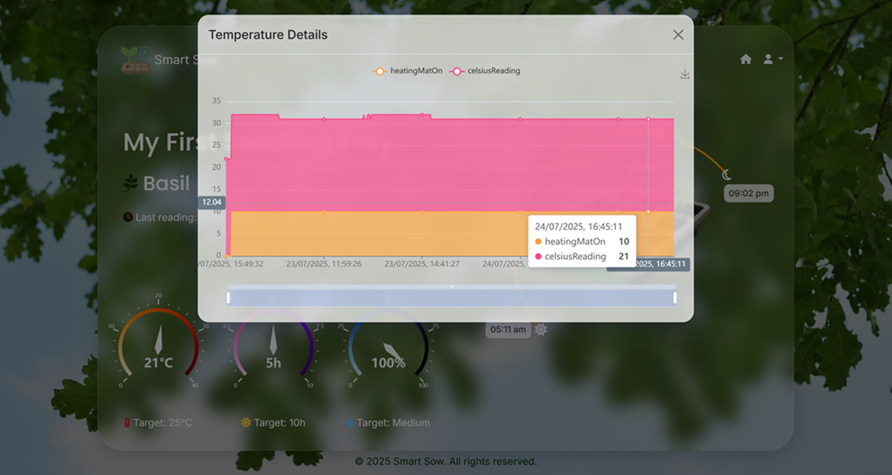
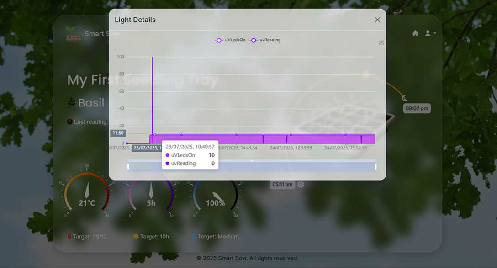
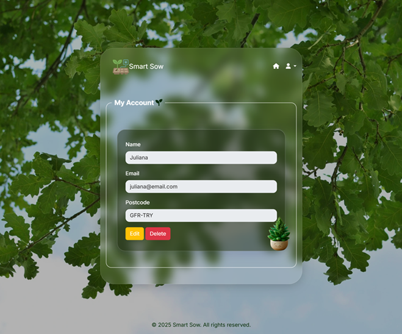
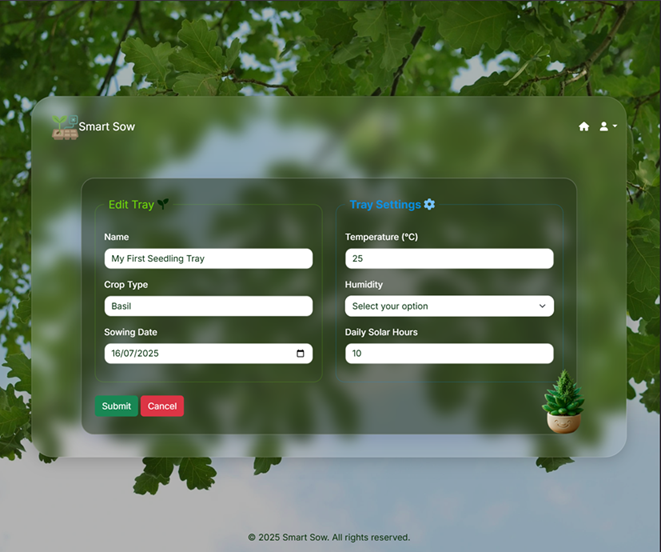

## Home page
  
*Figure 1 – Home Page*

  
*Figure 2 - Home page without login, see the button to login*

## Login

*Figure 3 - login form*

Once logged in, users gain full access to all features, including tray registration, real-time monitoring, historical charts, and system configuration.

  
*Figure 4 - After logged in, user menu is displayed*

## Charts
### Gauge charts 
  
*Figure 5 - Last tray reading sensors, gauge charts and sun real position*

### Stacked bar charts 
  
*Figure 6 – Temperature historical stack bar chart*

  
*Figure 7 – Uv Light historical stack bar chart*
**Note:** During the days these readings were taken, there was no natural sunlight due to heavy cloud cover. As a result, the UV sensor readings remained at 0, while the UV LEDs were activated (value: 10) to compensate for the lack of sunlight.

  
*Figure 8 – Humidity historical stack bar chart*

## My Trays
  
*Figure 9 – Tray Management Page*

## User Flow

*Figure 10 - Form to user create account*

*Figure 11 - Form to user edit account - except password*

*Figure 12 - Form to user register tray and settings*

*Figure 13 - Form to user edit tray and settings*

*Figure 14 - Tray token*

[See charts details here](#charts)

